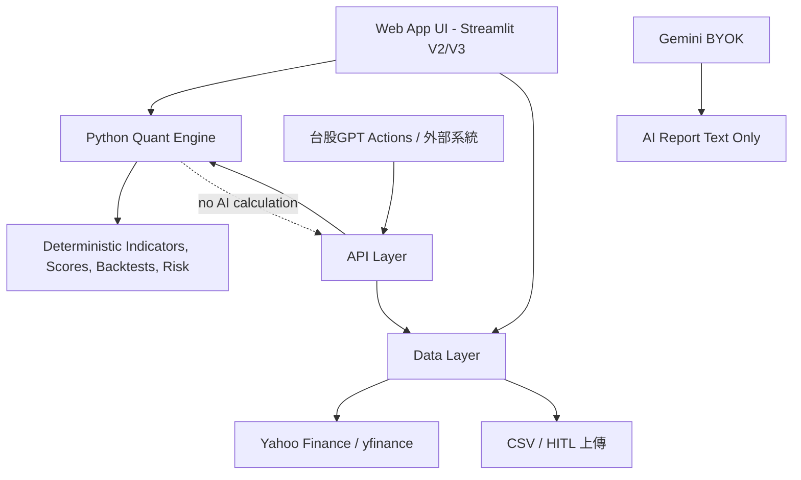

# WallWin Gem V3 API-first 架構審查

日期：2026-06-05

最新狀態：

| 階段 | 狀態 | 說明 |
|---|---|---|
| Phase 1 | 完成 | 已建立 `wallwin_core` Python API-first core |
| Phase 2A | 完成 | Streamlit V2 分析與回測流程已優先呼叫 V3 core，失敗時回退 V2 |
| Phase 3A | 完成 | 已新增 FastAPI HTTP layer：`api_app.py` |

## 1. CTO 級結論

WallWin Gem V2 已經具備量化引擎與 Streamlit 操作控制台，但目前主要技術債是 `app.py` 同時承擔 UI、資料抓取、量化計算、AI 報告、CSV/HITL、回測與視覺化。這種架構可以快速做產品驗證，但不適合直接接 Custom GPT Actions，因為外部系統需要穩定、可測試、可重現的 API contract。

V3 不應重做 UI，也不應一次把 Streamlit 改成後端服務。最小可行路線是：

1. 先抽出純 Python Quant Engine。
2. 再建立不依賴 Web server 的 API facade。
3. Streamlit V2 繼續保留，後續逐步改成呼叫同一套 core。
4. 需要外部 HTTP 呼叫時，再用 FastAPI 包裝 facade。
5. 最後輸出 OpenAPI schema 給台股GPT Custom GPT Actions。

目前已完成 Phase 1、Phase 2A、Phase 3A。`app.py` 保留 V2 操作體驗，但分析與回測已優先走 V3 core；`api_app.py` 提供 HTTP endpoint。

## 2. V2 現有功能盤點

### 檔案架構

| 路徑 | 功能 | V3 判斷 |
|---|---|---|
| `app.py` | Streamlit UI、資料抓取、量化計算、回測、AI 報告、HITL、CSS | V2 主程式保留；Phase 2A 已優先接 V3 core |
| `api_app.py` | FastAPI HTTP layer | Phase 3A 新增 |
| `requirements.txt` | Streamlit、yfinance、pandas、ta、google-genai、reportlab、plotly、FastAPI、Uvicorn | Phase 3A 新增 API 依賴 |
| `.streamlit/` | Streamlit secrets/config | 保留 |
| `SECURITY.md` | GitHub 安全政策 | 保留 |
| `WALLWIN_OPTIMIZATION_PROPOSAL.md` | 先前優化方案 | 保留 |
| `wallwin_core/` | V3 API-first 核心 | 新增 |
| `tests/` | V3 可驗證測試 | 新增 |

### 資料來源

| 資料來源 | 用途 | 風險 | V3 處理 |
|---|---|---|---|
| Yahoo Finance / yfinance | OHLCV、基本資料 | rate limit、缺值、欄位不穩 | Data Layer 回傳狀態，不讓例外炸出 |
| CSV / HITL | 使用者私房基本面、財報、校準資料 | 編碼、欄位不一致 | 以來源標記 `input.hitl` 管控 |
| Streamlit Secrets | BYOK、APP_PASSWORD | 資安風險 | V3 core 不直接讀 secrets |
| Gemini BYOK | AI 報告 | 429/503/quota/model unavailable | 不參與量化計算 |
| Google Finance | 無 | 使用者已決議終止 | V3 明確不加入 |

### 現有計算邏輯

V2 已有以下核心能力：

| 能力 | 代表函式 |
|---|---|
| 多因子矩陣 | `score_multifactor()` |
| 技術指標包 | `build_technical_pack()` |
| 當沖矩陣 | `calculate_daytrade_matrix()` |
| 燈號判斷 | `get_light()` |
| 交易計畫 | `build_trade_plan()` |
| 策略回測 | `run_signal_backtest()` |
| walk-forward 校準 | `run_walk_forward_calibration()` |
| HITL 模板/覆蓋率 | `build_hitl_template()`、`hitl_coverage()` |
| AI 報告匯出 | `build_report_markdown()`、`markdown_to_pdf_bytes()` |

### 技術債

| 技術債 | 影響 | V3 解法 |
|---|---|---|
| UI/資料/計算耦合在 `app.py` | 難測試、難接 API | 抽 `wallwin_core` |
| yfinance 例外可能中斷流程 | 外部 API 不穩 | Data Layer 狀態化 |
| API contract 不存在 | GPT Actions 無法穩定呼叫 | 定義 endpoint schema |
| AI 報告錯誤與量化計算混在同一產品流 | 容易誤解為 AI 算分 | AI 僅做文字輸出，分數由規則引擎 |
| 欄位名稱與中文 UI 綁定 | 外部整合困難 | V3 output 使用穩定英文 key，中文可由 UI 轉譯 |

## 3. V3 分層架構



### Web App UI

給人操作，保留 Streamlit。負責表單、分頁、視覺化、下載、使用者提醒、Secrets 管理。

### Python Quant Engine

負責數學計算。不得呼叫 LLM，不得隱性抓網路資料。輸入什麼資料，就用什麼資料算出結果。

### API Layer

給台股GPT Actions 或外部系統呼叫。Phase 1 先是 Python function facade；Phase 2/3 可包 FastAPI。

### Data Layer

負責資料來源與錯誤狀態。yfinance rate limit、空資料、使用者上傳資料不足，都要回傳可解讀狀態。

## 4. API Schema 草案

所有 API 回傳共同外層：

```json
{
  "api_version": "3.0.0-phase1",
  "endpoint": "/analyze/swing",
  "status": "OK",
  "meta": {
    "status": "OK",
    "confidence": "high",
    "source_tags": ["wallwin.rule_engine", "input.ohlcv"],
    "warnings": [],
    "errors": [],
    "insufficient_data": []
  },
  "input_echo": {},
  "result": {}
}
```

### 狀態碼

| status | 意義 |
|---|---|
| `OK` | 可用結果 |
| `DATA_INSUFFICIENT` | 資料不足，不能可靠計算 |
| `VALIDATION_ERROR` | 輸入 schema 或欄位錯誤 |
| `DATA_SOURCE_ERROR` | 資料來源失敗 |
| `DATA_SOURCE_RATE_LIMIT` | yfinance 或外部來源被限流 |

### 信心等級

| confidence | 規則 |
|---|---|
| `high` | 至少 252 筆 OHLCV |
| `medium` | 至少 120 筆 OHLCV |
| `low` | 至少 60 筆 OHLCV |
| `insufficient` | 不足 60 筆，或驗證失敗 |

### 來源標記

| source_tag | 意義 |
|---|---|
| `wallwin.rule_engine` | WallWin 規則引擎 |
| `input.ohlcv` | 呼叫端提供 OHLCV |
| `input.hitl` | 呼叫端提供 HITL/人工校準 |
| `input.info` | 呼叫端提供基本面 info |
| `input.benchmark_ohlcv` | 呼叫端提供 benchmark |
| `input.intraday_ohlcv` | 呼叫端提供當沖 5 分 K |
| `yfinance` | Data Layer 從 yfinance 抓取 |

## 5. Endpoint 定義

### `GET /health`

Input：無。

Output：

```json
{
  "service": "WallWin_Gem",
  "version": "3.0.0-phase1",
  "mode": "api-first-phase1",
  "fastapi_enabled": true,
  "http_layer": "FastAPI",
  "http_version": "3.0.0-phase3a"
}
```

### `POST /analyze/long-term`

定位：長期投資，預設 `style=投資`、`mode=白馬模式`。

Input：

```json
{
  "symbol": "2206.TW",
  "ohlcv": [{"Date": "2026-01-02", "Open": 60, "High": 61, "Low": 59, "Close": 60.5, "Volume": 1000000}],
  "info": {"trailingPE": 10.4, "returnOnEquity": 0.12},
  "advanced": {"ROE": 12.0, "營收YoY": 8.5},
  "benchmark_ohlcv": [],
  "mode": "白馬模式",
  "fetch": false
}
```

Output result：

```json
{
  "symbol": "2206.TW",
  "style": "投資",
  "mode": "白馬模式",
  "light": "紅燈",
  "advice": "品質分數不足，暫不啟動新倉位",
  "engine": {
    "win_score": 42.7,
    "white_score": 42.7,
    "black_score": 36.6,
    "bucket": "D",
    "factor_scores": {},
    "weights": {},
    "metrics": {},
    "hard_flags": []
  },
  "trade_plan": {}
}
```

### `POST /analyze/swing`

定位：波段，預設 `style=波段`、`mode=黑馬模式`。Schema 同 long-term。

### `POST /analyze/daytrade`

定位：當沖，預設 `style=當沖`、`mode=黑馬模式`。

額外 input：

```json
{
  "intraday_ohlcv": [{"Date": "2026-06-05 09:05:00", "Open": 60, "High": 60.2, "Low": 59.8, "Close": 60.1, "Volume": 50000}],
  "daytrade_direction": "做多"
}
```

Output 額外 result：

```json
{
  "daytrade": {
    "available": true,
    "intraday_vwap": 60.1,
    "orb_high": 60.8,
    "orb_low": 59.7,
    "long_bias_score": 80,
    "short_bias_score": 20
  }
}
```

### `POST /scan/watchlist`

Input：

```json
{
  "symbols": ["2206.TW", "2330.TW"],
  "market_data": {
    "2206.TW": [{"Date": "2026-01-02", "Open": 60, "High": 61, "Low": 59, "Close": 60.5, "Volume": 1000000}]
  },
  "mode": "黑馬模式"
}
```

Output：

```json
{
  "candidates": [
    {"symbol": "2330.TW", "win_score": 72.5, "bucket": "B", "light": "藍燈", "hard_flags": []}
  ],
  "rejected_or_unscored": []
}
```

### `POST /backtest/signal`

Input：

```json
{
  "symbol": "2206.TW",
  "ohlcv": [],
  "params": {
    "hold": 20,
    "rvol": 1.2,
    "max_atr": 5,
    "stop": 8,
    "target": 16,
    "trailing": 10,
    "fee": 0.1425,
    "slippage": 0.1
  }
}
```

Output：

```json
{
  "stats": {
    "交易次數": 10,
    "勝率%": 60,
    "平均淨報酬%": 3.2,
    "獲利因子": 1.8
  },
  "trades": []
}
```

### `POST /risk/position-size`

Input：

```json
{
  "entry": 60,
  "stop": 55,
  "account_size": 1000000,
  "risk_pct": 1,
  "max_position_pct": 20
}
```

Output：

```json
{
  "quantity": 2000,
  "risk_amount": 10000,
  "actual_risk": 10000,
  "notional": 120000
}
```

### `POST /export/report`

Input：一個 `status=OK` 的 analysis response。

Output：

```json
{
  "format": "markdown",
  "content": "# WallWin Gem API Report ..."
}
```

Phase 1 報告為規則式 Markdown，不呼叫 Gemini，避免 quota/503 影響 API 穩定性。

## 6. 分階段 Implementation Plan

### Phase 1：最小可行 V3 Core

狀態：已啟動。

內容：

| 工作 | 狀態 |
|---|---|
| 新增 `wallwin_core/quant_engine.py` | 完成 |
| 新增 `wallwin_core/api_layer.py` | 完成 |
| 新增 `wallwin_core/data_layer.py` | 完成 |
| 新增 `wallwin_core/schemas.py` | 完成 |
| 新增 unittest 驗收 | 完成 |
| 不修改 `app.py`，保留 V2 UI | 完成 |

### Phase 2A：Streamlit 接 Core

狀態：已完成。

已完成接入：

| UI 流程 | 接入方式 |
|---|---|
| 多因子分析 | `call_v3_analysis()` 優先呼叫 `wallwin_core.api_layer` |
| 燈號/交易計畫 | 使用 V3 response 的 `light/advice/trade_plan` |
| 策略回測 | 優先呼叫 `v3_api.backtest_signal()`，再轉回 V2 中文表格 |
| V3 狀態提示 | 主畫面與 sidebar 顯示 V3 core 狀態、信心等級、來源標記 |
| fallback | V3 失敗時使用 V2 原函式，避免 UI 中斷 |

後續可再逐步瘦身：

優先順序：

1. `run_signal_backtest`
2. `build_trade_plan`
3. `calculate_daytrade_matrix`
4. `score_multifactor`

### Phase 3A：FastAPI HTTP Layer

狀態：已完成。

已新增：

| 檔案 | 功能 |
|---|---|
| `api_app.py` | FastAPI app |
| `tests/test_fastapi_api.py` | HTTP endpoint 測試 |

本機啟動：

```powershell
python -m uvicorn api_app:app --host 127.0.0.1 --port 8000
```

本機連結：

| Endpoint | URL |
|---|---|
| Health | `http://127.0.0.1:8000/health` |
| API Docs | `http://127.0.0.1:8000/docs` |
| OpenAPI JSON | `http://127.0.0.1:8000/openapi.json` |

Phase 3B 建議先加入 API key header，例如 `X-WallWin-API-Key`，再對外開放，避免匿名高頻呼叫。

### Phase 4：台股GPT Actions

輸出 OpenAPI，讓台股GPT 呼叫：

1. `/analyze/swing`
2. `/risk/position-size`
3. `/backtest/signal`
4. `/export/report`

初期不建議開 `/scan/watchlist` 給無限制外部使用，避免 yfinance 與 Streamlit Cloud 資源被耗盡。

## 7. 已新增或需修改檔案

### 已新增

| 檔案 | 說明 |
|---|---|
| `wallwin_core/__init__.py` | V3 package entry |
| `wallwin_core/schemas.py` | API status/meta/schema helper |
| `wallwin_core/quant_engine.py` | 純量化計算 |
| `wallwin_core/data_layer.py` | yfinance/資料來源狀態封裝 |
| `wallwin_core/api_layer.py` | Phase 1 API facade |
| `tests/test_v3_api_layer.py` | 第一階段單元測試 |
| `V3_API_FIRST_ARCHITECTURE.md` | 本架構文件 |

### 後續可能修改

| 檔案 | 階段 |
|---|---|
| `app.py` | Phase 2A 已修改；後續可繼續瘦身 |
| `requirements.txt` | Phase 3A 已新增 `fastapi`、`uvicorn`、`httpx2` |
| `api_app.py` | Phase 3A 已新增 |
| `openapi.wallwin.json` | Phase 4 可由 `/openapi.json` 匯出 |

## 8. 測試方式與驗收標準

### 測試指令

```powershell
python -m py_compile wallwin_core\__init__.py wallwin_core\schemas.py wallwin_core\quant_engine.py wallwin_core\data_layer.py wallwin_core\api_layer.py
python -m py_compile app.py api_app.py
python -m unittest discover -s tests
python -m uvicorn api_app:app --host 127.0.0.1 --port 8000
```

### 驗收標準

| 驗收項目 | 標準 |
|---|---|
| V2 UI 未破壞 | Streamlit 可啟動並回應 200 |
| API 可呼叫 | `health()`、三種 analyze、scan、backtest、risk、export 均有 Python callable |
| HTTP API 可呼叫 | `/health` 回傳 `fastapi_enabled=true` |
| 可測試 | unittest 通過 |
| 可重現 | 同一筆 OHLCV/input 得到同一組分數 |
| 錯誤可控 | 資料不足、欄位錯誤、來源限流以 status 回傳 |
| 無 AI 幻覺計算 | 分數/燈號/回測/風控不呼叫 Gemini |
| 無 Google Finance | Data Layer 僅支援 yfinance 與顯式 input |
